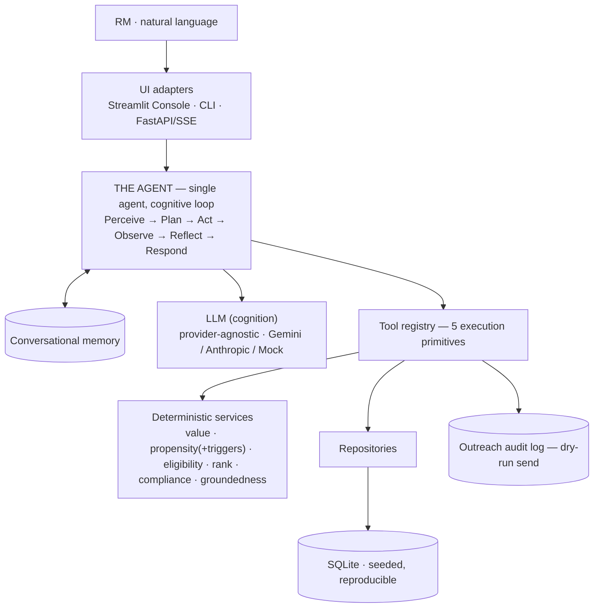

# RM Copilot — Agentic AI for Banking CRM

> A conversational **AI agent** that helps a bank **Relationship Manager (RM)** turn one
> natural-language request into a ranked list of high-potential customers, a per-customer
> product recommendation, and personalized, compliant outreach — each with **reason codes**.

```
"Find high-value customers likely to convert for a personal loan this month
 and generate personalized WhatsApp messages."
```

From that single sentence the agent decides what to do, runs the work, and returns an
explainable answer — then holds a conversation: *"Why her?"*, *"Redo that in Hindi"*,
*"Show only the ones from Indore."*

---

## What is RM Copilot?

A retail bank's RM manages hundreds of customers and is expected to cross-sell the right
product at the right moment while staying compliant. Doing this well means fusing many
signals — balances, product holdings, repayment behavior, life-stage, and *timing* — and
then writing outreach that is personalized yet never makes a promise the bank can't keep.

RM Copilot is an **agent** that does this end-to-end from plain language. It is built for
the Indian retail-banking context (₹, en/Hindi/Hinglish). The WhatsApp send is
**simulated** (dry-run + audit log) — no message ever leaves the system.

## What problem does it solve?

| The RM's question | What the agent produces |
|---|---|
| *Who should I talk to this month?* | A **ranked** shortlist (Value × Propensity) with a *"why now"* trigger per customer |
| *What do I offer them?* | An eligibility-checked **product recommendation** per customer |
| *What do I say?* | A **personalized, compliant** WhatsApp draft, grounded in that customer's real data |
| *Why this person / why this number?* | **Reason codes** behind every score and every figure in the message |

## Why is this an *agentic* AI system (not a chatbot or a pipeline)?

A single agent runs an explicit **cognitive loop** and **owns the workflow** — it is not a
hardcoded `retrieve → rank → draft → respond` script:

**Perceive → Plan → Act → Observe → Reflect → Respond**, with conversational **Memory**.

The agent *decides* the workflow each turn: what the RM wants, which tools to call, whether
to draft messages at all, how many, whether to filter prior results, whether to ask for
clarification, and when to stop. The load-bearing design split:

- **The LLM does cognition** — understand intent, plan, choose tools, adapt, clarify, reflect, synthesize prose.
- **Deterministic code does execution** — scoring, eligibility, ranking, compliance, groundedness, persistence, audit.

> **The LLM never computes a score, applies a rule, or invents a fact.** That makes the
> system explainable, testable without a model, and safe by construction.

Full rationale in [`docs/discovery.md`](docs/discovery.md), [`docs/solution.md`](docs/solution.md),
and [`docs/architecture.md`](docs/architecture.md).

## Key capabilities

- **Natural-language → explainable workflow** in one turn.
- **Two deterministic scores** — *Value* (worth pursuing) and *Propensity* (likely to convert now), config-driven, each reason-coded with a **confidence** level.
- **Temporal "why now" triggers** — FD maturing, EMI ending, large outflow, salary hike, festival window.
- **Eligibility & recommendation** — age/KYC/income/delinquency gates plus fraud-flag and recent-default hard-exclusions.
- **Guardrailed outreach** — deterministic **groundedness** (every figure traces to real data) + **compliance** (no guaranteed-approval claims, mandatory opt-out, PII-safe), with consent suppression (DND / opt-out).
- **Conversational memory** — follow-ups resolve against the prior result set ("why her?", "redo in Hindi", "only those in Indore").
- **Live reasoning trace** — the cognitive loop is streamed and inspectable in the UI (no raw chain-of-thought).
- **Provider-agnostic LLM** — Gemini (default) or Anthropic/Claude, selectable at runtime; deterministic mock for tests.
- **No-code extensibility** — products are YAML playbooks; scoring weights/triggers are YAML config.

## High-level architecture



Dependencies point **inward** toward the pure `domain`:
`ui → agent → tools → services → domain` and `tools → data → domain`. The LLM is confined
to the `agent` layer; `services`/`domain` never call it. See
[`docs/architecture.md`](docs/architecture.md) for component, runtime, sequence, and
data-flow diagrams.

## Technology stack

| Concern | Choice | Why |
|---|---|---|
| Language | **Python 3.12**, `src/` layout, typed (`py.typed`) | Modern typing, clean packaging |
| Models / I/O | **Pydantic v2**, **pydantic-settings** | Typed domain, tool schemas, env config |
| Cognition (LLM) | **Google Gemini** (`google-genai`, default `gemini-3.1-flash-lite`); **Anthropic Claude** (`anthropic`) | Provider-agnostic via `LLMClient` + `LLMFactory`; no lock-in |
| Storage | **SQLite** (stdlib) + repository pattern; money in **integer paise** | Zero-config, reproducible; no float money |
| Synthetic data | **Faker**, fixed seed | Deterministic, ground-truth signals embedded |
| Config | **YAML** — `scoring.yaml` + product playbooks | Tune scoring / add products without code |
| UI | **Streamlit** (Agent Console) + **rich** CLI | Visualizes cognition; thin adapters |
| API | **FastAPI + SSE** | Production-shaped; streams the reasoning trace |
| Quality | **pytest** (120 tests), **ruff**, **pre-commit** | Lint-clean, fast, no token spend in tests |

## Quick start

```bash
cp .env.example .env            # set GEMINI_API_KEY (or RM_COPILOT_LLM_API_KEY)
make setup                      # install package + dev tooling
make seed                       # build the deterministic synthetic dataset (~500 customers)
make test                       # 120 tests (mocked LLM — no network, no token spend)
```

`make setup` installs the dev extra. For the runnable surfaces, add the extras you need:
`pip install '.[llm,ui,api]'` (Gemini + Streamlit + FastAPI). Anthropic: `pip install '.[anthropic]'`.

## How to run

```bash
make ui      # Streamlit Agent Console  → http://localhost:8501   (recommended demo)
make api     # FastAPI + SSE             → http://localhost:8000/docs
make run     # conversational CLI (streams the reasoning trace)
```

The LLM provider/model is **selectable in the Streamlit sidebar** (Gemini or Anthropic) or
via `RM_COPILOT_LLM_*` env vars. Tests and CI use a deterministic `MockClient` and require
no key.

### Demo flow (≈2 minutes)
1. *"Find high-value personal-loan prospects this month"* → ranked list + top-3 drafts + live loop.
2. *"Why CUST000003?"* → factor-by-factor explanation from memory (no re-ranking).
3. *"Redo that message in Hindi"* → localized re-draft, guardrails re-run.
4. *"Show only the ones from Indore"* → filters the current set in place.

## Project structure

```
src/rm_copilot/
  domain/         pure entities, enums, money (no I/O)
  data/           SQLite schema, repositories, synthetic seed, product catalog
  services/       deterministic logic: scoring, eligibility, recommend, rank, compliance, groundedness
  tools/          typed tool wrappers + registry (the agent's execution primitives)
  agent/          THE AGENT: orchestrator (cognitive loop) + planner/executor/reflector/synthesizer/memory
    llm/          provider-agnostic LLMClient + LLMFactory (Gemini, Anthropic, Mock)
  api/            FastAPI + SSE
  observability/  trace/render helpers
  config/         settings, scoring.yaml loader, product playbooks
ui/               Streamlit Agent Console + CLI (thin adapters over the agent)
config/           scoring.yaml, playbooks/*.yaml
prompts/          versioned prompt assets (plan, reflect, respond, generate_outreach)
tests/            unit + integration (mocked LLM, real SQLite)
docs/             discovery.md · solution.md · architecture.md
```

## Documentation

| Document | Read it for |
|---|---|
| [`docs/discovery.md`](docs/discovery.md) | Problem understanding, discovery, and the **high-value scoring framework in detail** (Value/Propensity, triggers, playbooks, edge cases) |
| [`docs/solution.md`](docs/solution.md) | How the problem was solved — each subsystem and the reasoning behind it |
| [`docs/architecture.md`](docs/architecture.md) | The technical design — component/runtime/sequence/data-flow diagrams |

## License

MIT — see [`LICENSE`](LICENSE).
