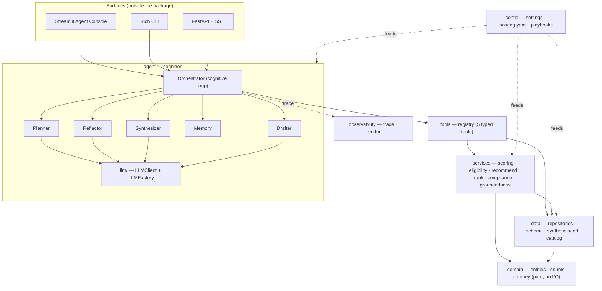
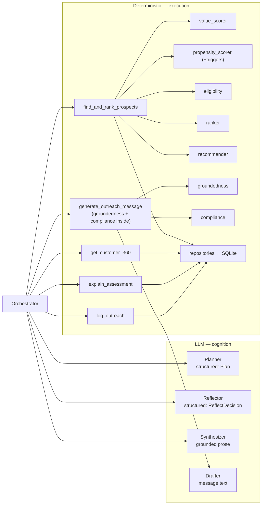
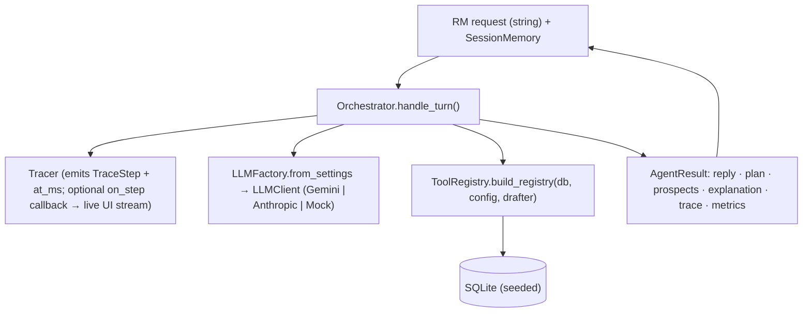
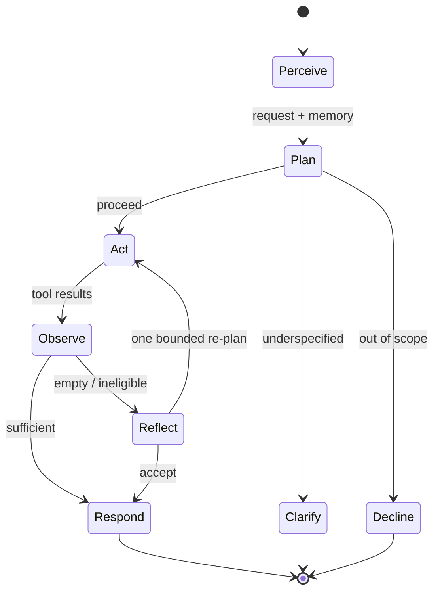
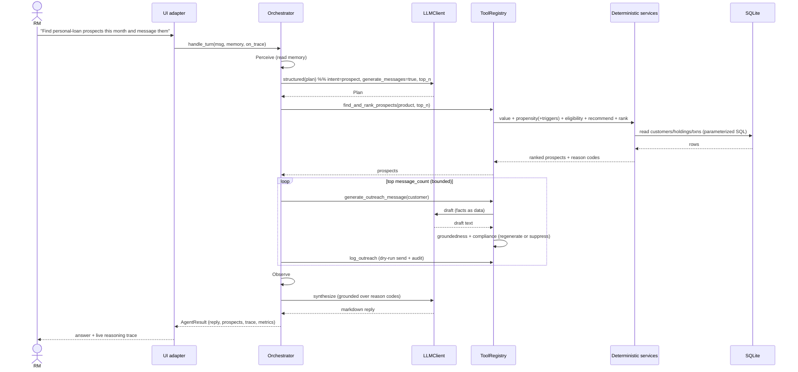
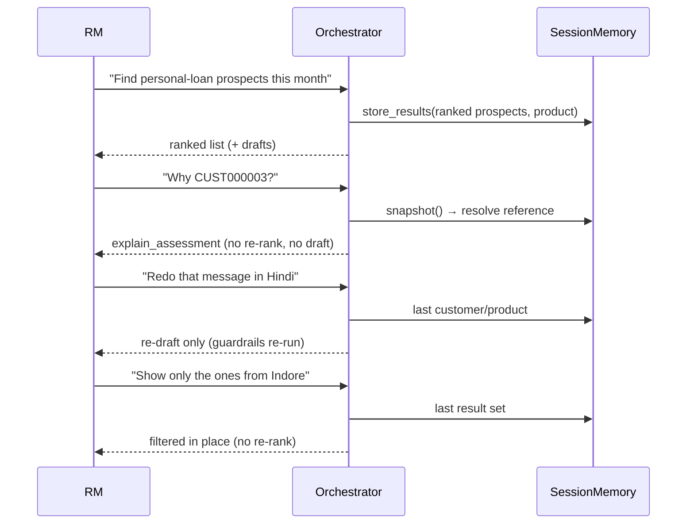
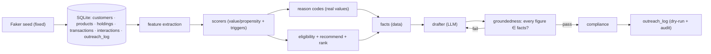
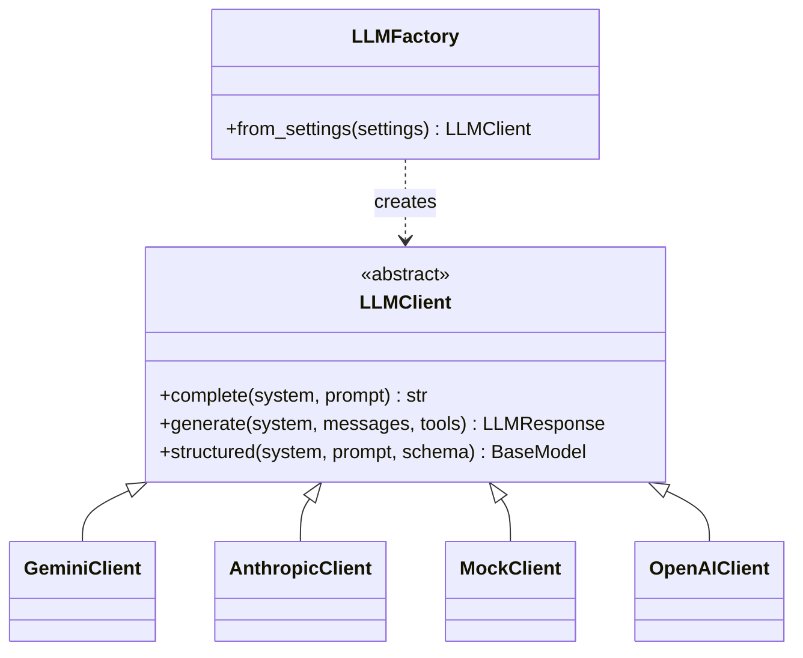
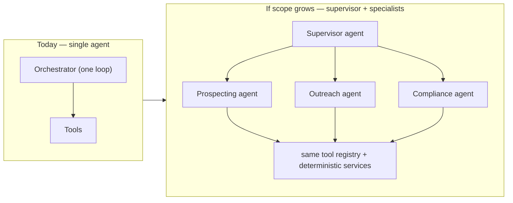

# Architecture — RM Copilot

*The technical design: how the system works internally.*

This document is diagram-led. For the problem understanding and discovery see
[`discovery.md`](discovery.md); for what each subsystem does see [`solution.md`](solution.md).

---

## 1. System architecture (layered)

Dependencies point **inward** toward the pure `domain`. The LLM lives only in the `agent`
layer; `services` and `domain` never call it. `config` feeds every layer; `observability`
is a cross-cutting sink.



**Rule enforced in code:** nothing in `domain`/`services` imports `agent`/`tools`/`data`
against the arrow, and no provider SDK is imported outside `agent/llm/`.

## 2. Component diagram



## 3. Runtime architecture



`RmCopilotApp` (in `agent/runtime.py`) is the UI-agnostic composition root: it wires the
database, scoring config, the provider-agnostic client, the tool registry, and the
orchestrator from settings. Every surface (Streamlit, CLI, FastAPI) is a thin adapter over
`app.ask(message, memory, on_trace=…)`.

## 4. The cognitive loop



Bounded by design: at most one reflect-driven re-plan and a hard cap on tool calls per
turn. Reflection may re-query or annotate but **never overwrites a deterministic score**.

## 5. Sequence — a full prospecting + outreach turn



## 6. Tool invocation flow

```mermaid
flowchart LR
    PL["Plan (intent + params)"] --> EX["Executor (deterministic interpreter)"]
    EX -->|prospect| F["find_and_rank_prospects"]
    EX -->|generate_messages?| G{"draft top N?"}
    G -->|"top message_count"| GEN["generate_outreach_message → log_outreach"]
    G -->|"beyond cap"| LIST["ranked-only card (NOT_DRAFTED)"]
    EX -->|explain| E["explain_assessment (memory)"]
    EX -->|redraft| RD["generate_outreach_message (memory)"]
    EX -->|filter| FL["filter current set in memory (no re-rank)"]
    F & GEN & E & RD & FL --> OBS["Observation"]
```



The **planner owns** which branch runs (intent), *whether* to draft (`generate_messages`),
*how many* (`message_count`, capped per turn and the cap surfaced), and any `city` filter.
The executor only realizes those decisions over deterministic tools — there is no fixed
`retrieve → draft → respond` pipeline.

## 7. Conversation lifecycle (multi-turn memory)



## 8. Data flow



Money is integer **paise** end-to-end (rounded only at display). **Scores are derived, not
stored** — they cannot drift from `scoring.yaml`.

## 9. Entity model

```mermaid
erDiagram
    CUSTOMER ||--o{ PRODUCT_HOLDING : holds
    CUSTOMER ||--o{ TRANSACTION : has
    CUSTOMER ||--o{ INTERACTION : has
    CUSTOMER ||--o{ OUTREACH_LOG : targeted_by
    PRODUCT  ||--o{ PRODUCT_HOLDING : instantiated_as
    PRODUCT  ||--o{ OUTREACH_LOG : about
    CUSTOMER {
        string customer_id PK
        string first_name
        string city
        string masked_pan
        bool   do_not_disturb
        bool   marketing_opt_in
        bool   fraud_flag
        date   last_default_date
    }
    PRODUCT_HOLDING {
        string product_id FK
        int    balance_paise
        date   maturity_or_end_date
    }
    TRANSACTION { int amount_paise; string direction; date txn_date }
    OUTREACH_LOG { string status; bool grounded; bool compliant }
```

`PRODUCT_HOLDING` unifies accounts, deposits, loans, and cards (no separate `Account`).
Products are defined by **YAML playbooks** loaded into the catalog — adding a product is a
new file, not a code change.

## 10. LLM abstraction



Business logic depends only on `LLMClient`. `LLMFactory` selects the provider from config
(`RM_COPILOT_LLM_*`). `GeminiClient` and `AnthropicClient` are real; `MockClient` is
deterministic for tests; `OpenAIClient` is a declared stub. **Only this package imports a
provider SDK** — so the deterministic core (and its scores) are identical regardless of the
model, and the whole system is testable with zero token spend.

## 11. Why deterministic services are separated from cognition

Cognition is probabilistic and non-reproducible; banking computation must be exact,
explainable, and auditable. Separating them yields:

- **Explainability** — every score/figure traces to deterministic code + real data.
- **Testability** — the core is unit-tested without a model; the agent is trajectory-tested with a mock.
- **Safety** — guardrails are deterministic and *internal to generation*, so the agent cannot bypass them; a hallucinated number fails groundedness.
- **Stability** — swapping the LLM provider cannot change a score or a ranking.

The model contributes judgment (intent, sequencing, adaptation, prose); the deterministic
layers contribute correctness. Neither does the other's job.

## 12. Why a single cognitive agent

The workflow is sequential, shares one context, and is bounded. A single agent running an
explicit loop is the simplest design that fully satisfies it, and it keeps the reasoning
**transparent and gradable**. "Researcher / scorer / writer" are *roles within one loop*,
not separate agents — modeling them as agents would add message-passing, more failure
modes, and less observability for no capability gain.

## 13. Future evolution toward multi-agent

The single-agent boundary is deliberately a clean seam, not a ceiling. Multi-agent is
warranted only if scope grows to where it pays for its overhead — e.g. **parallel,
independent sub-tasks** (campaign generation across many segments at once), **long-running /
durable** workflows needing checkpointing, or **specialized policies** (a separate
compliance/agent-of-record). The graduation path is additive:



Because the loop is isolated behind the `agent` layer and all computation lives in
deterministic services + the tool registry, introducing a supervisor and specialist agents
later would reuse the entire execution substrate unchanged — `domain`, `services`, `tools`,
and `data` would not move.

## 14. Repository structure

```
src/rm_copilot/
  domain/         entities.py · enums.py · money.py · assessment.py        (pure, no I/O)
  data/           connection · schema · mappers · repositories · database · catalog · synthetic · seed
  services/       features · triggers · value_scorer · propensity_scorer · eligibility
                  recommender · ranker · compliance · groundedness · assessment
  tools/          base · find_prospects · customer_360 · explain_assessment
                  generate_outreach · log_outreach · registry
  agent/          models · trace · memory · planner · executor · reflector
                  synthesizer · orchestrator · drafter · prompts · runtime
    llm/          base · factory · gemini · anthropic · mock · openai
  api/            schemas · app                                            (FastAPI + SSE)
  observability/  render
  config/         settings · scoring · playbooks
ui/               streamlit_app.py · cli.py                                (thin adapters)
config/           scoring.yaml · playbooks/*.yaml
prompts/          plan · reflect · respond · generate_outreach            (versioned)
tests/            unit/ · integration/ (mocked LLM, real SQLite)
```
